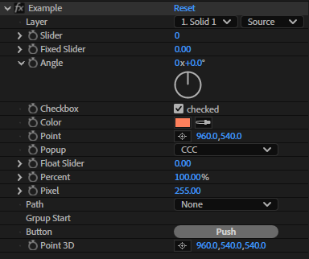

===============
Pseudo
===============

Pseudo Effectを取り扱う。

.. tabs::

    .. code-tab:: TypeScript

        (() => {
            const config = Atarabi.pseudo.create('Example')
                .layer('Layer', -1)
                .slider('Slider', 0, 0, 1000, 0, 100)
                .fixedSlider('Fixed Slider', 0, 0, 1000, 0, 100)
                .angle('Angle', 0)
                .checkbox('Checkbox', true, { text: 'checked' })
                .color('Color', { red: 255, green: 128, blue: 92 })
                .point('Point', 0.5, 0.5)
                .popup('Popup', 3, ['AAA', 'BBB', 'CCC', '(-', 'DDD', 'EEE'])
                .floatSlider('Float Slider', 0, 0, 1000, 0, 100)
                .percent('Percent', 100, 0, 1000, 0, 100)
                .pixel('Pixel', 1, 0, 10, 0, 1)
                .path('Path', 1)
                .groupStart('Grpup Start')
                .groupEnd()
                .button('Button', 'Push')
                .point3D('Point 3D', 0.5, 0.5, 0.5)
                .config();

            const comp = app.project.activeItem;
            if (comp instanceof CompItem) {
                const layers = filter(comp.selectedLayers, isAVLayer);
                Atarabi.pseudo.apply(config, layers);
            }

            function isAVLayer(layer: Layer): layer is AVLayer {
                return layer instanceof AVLayer || layer instanceof ShapeLayer || layer instanceof TextLayer;
            }

            function filter<T>(values: any[], fn: (value: any) => value is T): T[] {
                const arr: T[] = [];
                for (const value of values) {
                    if (fn(value)) {
                        arr.push(value);
                    }
                }
                return arr;
            }
        })();

    .. code-tab:: JavaScript
        
        (function () {
            var config = Atarabi.pseudo.create('Example')
                .layer('Layer', -1)
                .slider('Slider', 0, 0, 1000, 0, 100)
                .fixedSlider('Fixed Slider', 0, 0, 1000, 0, 100)
                .angle('Angle', 0)
                .checkbox('Checkbox', true, { text: 'checked' })
                .color('Color', { red: 255, green: 128, blue: 92 })
                .point('Point', 0.5, 0.5)
                .popup('Popup', 3, ['AAA', 'BBB', 'CCC', '(-', 'DDD', 'EEE'])
                .floatSlider('Float Slider', 0, 0, 1000, 0, 100)
                .percent('Percent', 100, 0, 1000, 0, 100)
                .pixel('Pixel', 1, 0, 10, 0, 1)
                .path('Path', 1)
                .groupStart('Grpup Start')
                .groupEnd()
                .button('Button', 'Push')
                .point3D('Point 3D', 0.5, 0.5, 0.5)
                .config();
            var comp = app.project.activeItem;
            if (comp instanceof CompItem) {
                var layers = filter(comp.selectedLayers, isAVLayer);
                Atarabi.pseudo.apply(config, layers);
            }
            function isAVLayer(layer) {
                return layer instanceof AVLayer || layer instanceof ShapeLayer || layer instanceof TextLayer;
            }
            function filter(values, fn) {
                var arr = [];
                for (var _i = 0, values_1 = values; _i < values_1.length; _i++) {
                    var value = values_1[_i];
                    if (fn(value)) {
                        arr.push(value);
                    }
                }
                return arr;
            }
        })();

上のスクリプトを実行すると、画像のようなpseudo effectが適用される。

流れとしては、

#. **Atarabi.pseudo.create()** を用いて、設定オブジェクトを形成するBuilderを呼ぶ。
#. **.floatSlider('Amount', 0, 0, 100, 0, 100)** のようにメソッドチェーンを用いて、欲しいパラメータを連ねていく。
#. **.config();** パラメータを追加し終わったら、最後に **config()** を呼びだし、設定オブジェクトを生成する。
#. **Atarabi.pseudo.apply(config, layers);** その設定オブジェクトを、 **apply()** に渡してやれば適用される。

適用せずに、プリセットとして出力したい場合は、以下のように代わりに **write()** を呼び出す。

.. tabs::

    .. code-tab:: TypeScript

        (() => {
            Atarabi.pseudo.create('Example')
                .floatSlider('Float Slider', 0, 0, 1000, 0, 100, { precision: 3, uiFlags: PF.ParamUIFlags.Disabled, flags: PF.ParamFlags.CannotTimeVary })
                .write(new File(`${Folder.desktop.absoluteURI}/Example.ffx`), new File(`${Folder.desktop.absoluteURI}/Example.json`));
        })();

    .. code-tab:: JavaScript

        (function () {
            Atarabi.pseudo.create('Example')
                .floatSlider('Float Slider', 0, 0, 1000, 0, 100, { precision: 3, uiFlags: 32 /* PF.ParamUIFlags.Disabled */, flags: 2 /* PF.ParamFlags.CannotTimeVary */ })
                .write(new File("".concat(Folder.desktop.absoluteURI, "/Example.ffx")), new File("".concat(Folder.desktop.absoluteURI, "/Example.json")));
        })();

これを実行すると、デスクトップにプリセットファイルと(.ffx)、設定オブジェクトをJSONにしたもの(.json)が作られる。どちらかだけを作りたい場合は、 **write(null, file)** のように片方にだけFileオブジェクトを渡せば良い。

.. code-tab:: JSON

    {
        "name": "Example",
        "matchName": "Pseudo/UbUn0C0/Example",
        "parameters": [
            {
                "type": "floatSlider",
                "name": "Float Slider",
                "value": 0,
                "validMin": 0,
                "validMax": 1000,
                "sliderMin": 0,
                "sliderMax": 100,
                "precision": 3,
                "displayFlags": 0,
                "uiFlags": 32,
                "flags": 2,
                "id": 1
            }
        ]
    }

Pseudo.create()
------------------------

``create(name: string, matchName?: string): Builder;``

設定オブジェクトを作るBuilderを呼び出す。matchNameを指定する場合は、 **Pseudo/** から始める必要がある。

.. versionadded:: 0.5.0

Pseudo.apply()
------------------------

``apply(config: Config, layers: AVLayer | AVLayer[]): void;``

設定オブジェクトを用いて、対象のレイヤーにPseudo Effectを適用する。

.. versionadded:: 0.5.0
