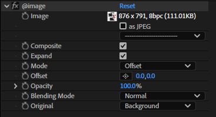
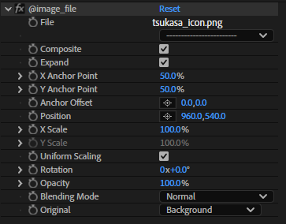
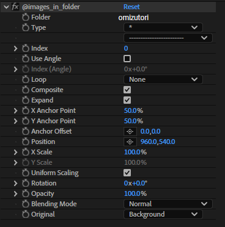

=======
@image
=======

画像データを扱うエフェクトプラグイン群。

@image
-------------------

エフェクトのパラメータとして画像データ自体を保持し、表示するエフェクト。

@image_file
-------------------

エフェクトのパラメータとして画像ファイルへのパスを保持し、その画像を表示するエフェクト。

@images_in_folder
-------------------

エフェクトのパラメータとして画像ファイルを含むフォルダへのパスを保持し、そのフォルダ内の画像を表示するエフェクト。
