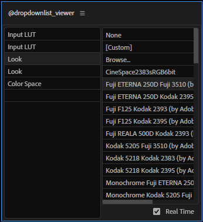

====================
@dropdownlist_viewer
====================

選択したエフェクトのドロップダウンリスト系のパラメータを展開する。

使い方
--------------------
展開したいエフェクトを選択し、UI上にカーソルを移動させると、自動的に展開する。

左側のリストにドロップダウンリストのパラメータが表示されるので選択すると、右側のリストに項目が羅列される。その項目をダブルクリックするとパラメータの値がその項目に変更される。

ダブルクリックが面倒な場合は、右下の **Real Time** をチェックすると、ダブルクリック要らずに変更出来る。
