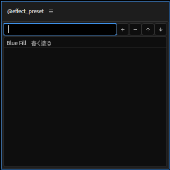

====================
@effect_preset
====================

エフェクトに関する簡易的なプリセットを作成、適用出来る(.ffxを生成するわけではない)。

使い方
--------------------

作成
^^^^^^^^^^^^^^^^^^^^
エフェクトリストでエフェクトを選択し（複数選択可）、 **+** ボタンを押すとプリセットを作成出来る。

削除
^^^^^^^^^^^^^^^^^^^^
プリセットのリストで削除したいプリセットを選択し、 **-** ボタンを押すと削除出来る。