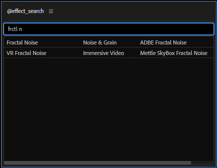
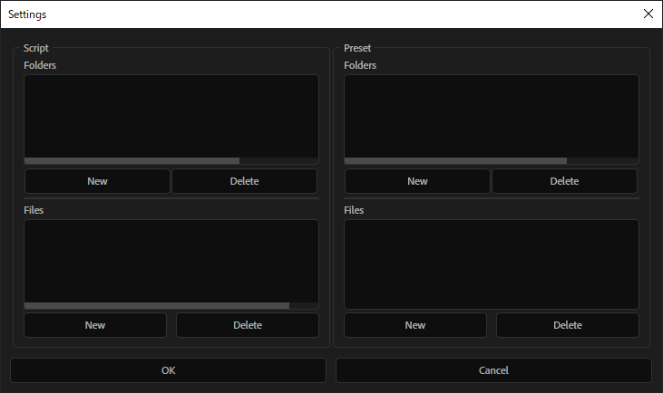

====================
@effect_search
====================

エフェクトを検索出来る。

スクリプト、プリセット
-----------------------
スクリプト(.jsx, .jsxbin)、プリセット(.ffx)も検索の対象にできる。

スクリプト、プリセットを検索の対象に追加したい場合は、検索窓に **\\\\** (バックスラッシュないし円マークを２回)と入力すると設定画面に移るので、そこで設定する。フォルダを再帰的に潜ってほしい場合は、リストの項目を右クリックして出てくるコンテクストメニューから設定できる。