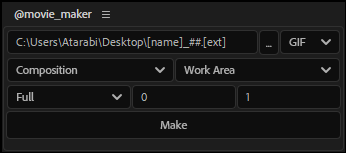
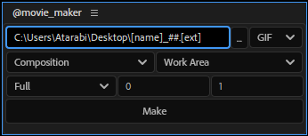
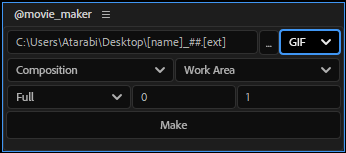
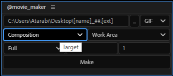
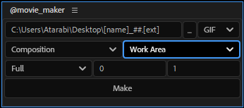
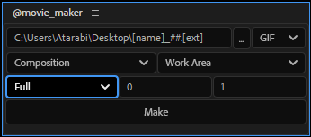
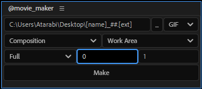
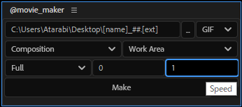
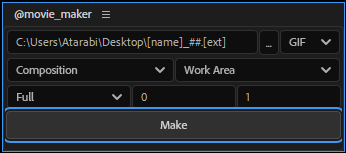

===============
@movie_maker
===============

コンポ、レイヤーの画を動画(GIF, APNG)として保存する。

解説
--------------------

ファイルパス
^^^^^^^^^^^^^^^^^^^^

保存先となるファイルパスを指定する。 **[name]** はコンポ名もしくはレイヤー名に、 **[ext]** は指定した画像形式に対応した拡張子に、 **##** はインデックス番号に、保存時にそれぞれ置換される。

画像形式
^^^^^^^^^^^^^^^^^^^^

画像形式を選択する。

対象
^^^^^^^^^^^^^^^^^^^^

対象をコンポジションか選択レイヤーかで選ぶ。

範囲
^^^^^^^^^^^^^^^^^^^^

動画にしたい範囲をワークエリア、コンポジション全体から選択する。

解像度
^^^^^^^^^^^^^^^^^^^^

解像度を **Full**、 **Half** ……から選択する。

スキップ
^^^^^^^^^^^^^^^^^^^^

何フレームおきに出力するかを決定する。

スピード
^^^^^^^^^^^^^^^^^^^^

何倍速にするかを決める。

出力
^^^^^^^^^^^^^^^^^^^^

**Make** ボタンを押して出力。