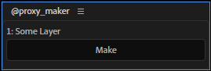
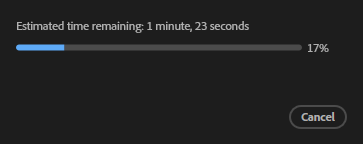
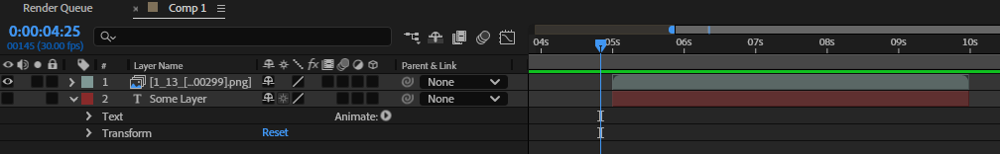

===============
@proxy_maker
===============

レイヤー単位でプリレンダングをする（レンダキュー経由でレンダリングするわけではないのでそれ相応の速度）。レンダリングされたpngファイルは、aepファイルがあるフォルダの@proxyフォルダ以下に保存される（同じフォルダに性質の異なる複数のaepファイルがあることは想定していない）。

初回はレイヤーのインポイントからアウトポイントまですべてをレンダリングする。二回目以降は、ワークエリアの範囲だけ再レンダリングする。