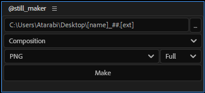
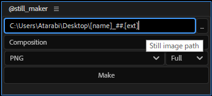
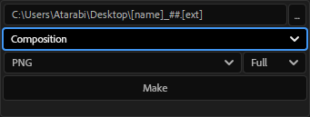
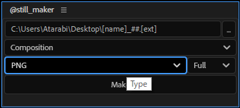
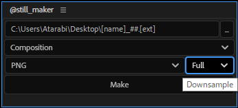
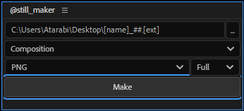

===============
@still_maker
===============

現在時間のコンポ、レイヤーの画を静止画として保存する。

解説
--------------------

ファイルパス
^^^^^^^^^^^^^^^^^^^^

保存先となるファイルパスを指定する。 **[name]** はコンポ名もしくはレイヤー名に、 **[ext]** は指定した画像形式に対応した拡張子に、 **##** はインデックス番号に、保存時にそれぞれ置換される。

対象
^^^^^^^^^^^^^^^^^^^^

対象をコンポジションか選択レイヤーかで選ぶ。

画像形式
^^^^^^^^^^^^^^^^^^^^

画像形式を選択する。

解像度
^^^^^^^^^^^^^^^^^^^^

解像度を **Full**、 **Half** ……から選択する。

出力
^^^^^^^^^^^^^^^^^^^^

**Make** ボタンを押して出力。