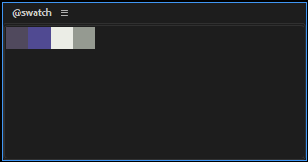

===============
@swatch
===============

カラースウォッチ。

使い方
--------------------

登録
^^^^^^^^^^^^^^^^^^^^

何かを選択した状態でUI上でミドルクリックすると登録される。

- 色パラメータを選択している場合、その色が登録される。
- それ以外の場合で、エフェクトを選択している場合、そのエフェクトの中に含まれる色パラメータから初期状態から変化しているものを登録する。
- それ以外の場合で、選択したレイヤがー平面レイヤーの場合、平面レイヤーの色が登録される。

アンレジスター
^^^^^^^^^^^^^^^^^^^^
削除したい色の上でダブルクリックすると登録が解除される。