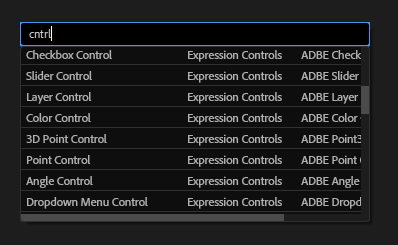
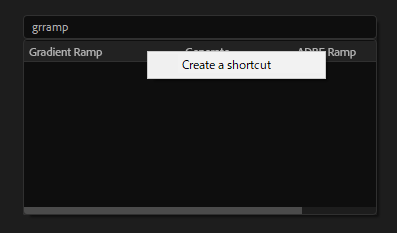
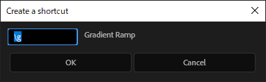
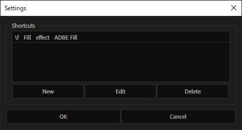

====================
@effect_launcher
====================

`Quick Menu <https://aescripts.com/quick-menu/>`_**、 `FX Console <https://www.videocopilot.net/blog/2018/05/fx-console-updated-to-v1-0-3/>`_ ライクのスクリプト。

使い方
-------------------
Windowsの場合は、 **Ctrl+Space**、Macの場合は、 **Option+Space** で起動する。その後、検索窓に文字を入力してエフェクトを絞っていく。

Shortcut機能
-------------------
特定の文字列を入力したときに、自動的にエフェクト適用、スクリプト実行、プリセット適用を行えるようにする。

エフェクトのショートカットを追加したい場合は、対象のエフェクトを選択した状態で右クリックをして、 **Create a shortcut** を選択肢し、キーとなる文字列を設定する。

スクリプト、プリセットのショートカットを追加したい場合は、検索窓に **\\\\** (バックスラッシュないし円マークを２回)と入力すると設定画面に移るので、そこで設定する。
