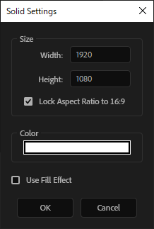

================
@hook_solid
================

既存の新規平面コマンドを上書きして、出来るだけ既存の平面を再利用するようにする。

API
-------------------

addSolid()
^^^^^^^^^^^^^^^^^^^^

``Atarabi.API.invoke('@hook_solid', 'addSolid', [comp: CompItem, width: number, height: number, color?: [red: number, green: number, blue: number]]): AVLayer;``

@hook_solidのように平面を追加する。
